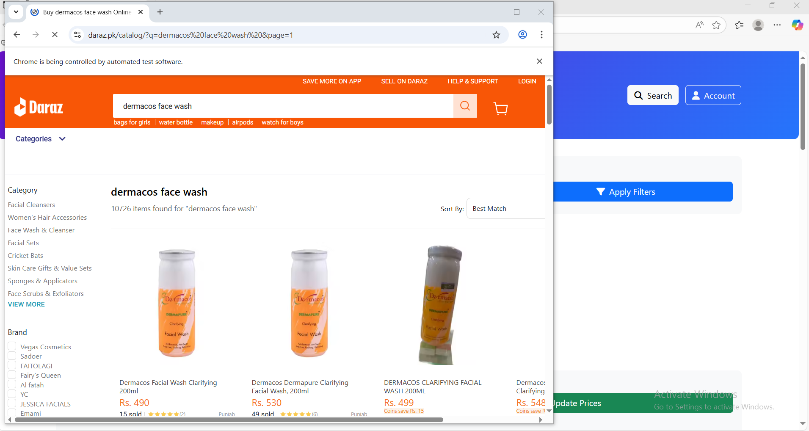
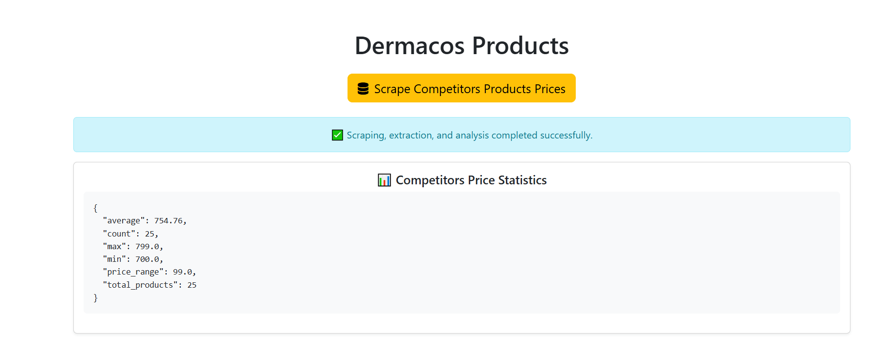
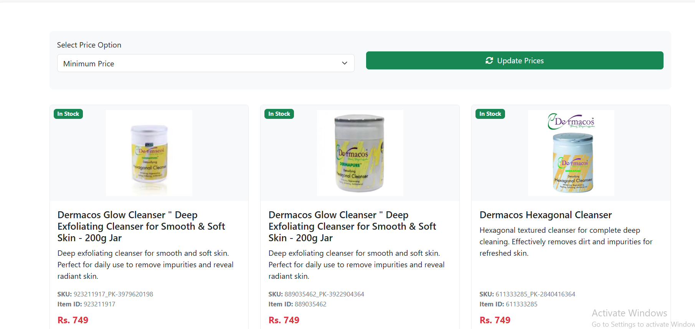

# Automated-competitor-price-tracking

# 🛒 Automated Competitor Price Tracking

The **Automated Competitor Price Tracking** system is a tool designed to monitor and compare product prices across multiple competitor websites automatically. It helps businesses stay competitive by gathering real-time pricing data and generating insights for pricing strategy optimization.

## 🚀 Features
- Automatically scrapes product prices from competitor websites.
- Stores and updates historical pricing data.
- Detects price changes and trends over time.
- Provides easy comparison and visualization of competitor prices.
- Can be integrated with e-commerce platforms or dashboards.

## 🧠 Use Case
This project is ideal for:
- E-commerce businesses looking to stay ahead of competitors.
- Developers building dynamic pricing systems.

## 🛠️ Technologies Used
- **Python** (for automation and data processing)
- **BeautifulSoup / Scrapy** (for web scraping)
- **Pandas / NumPy** (for data analysis)
- **Matplotlib / Plotly** (for data visualization)
- **Flask / FastAPI** (optional – for creating dashboards or APIs)


## 📈 How It Works
1. The script fetches product data from predefined competitor URLs.
2. Extracted prices are stored in a local  directory.
3. The system compares current prices with previous data.
4. Generates alerts or reports when price changes occur.

## 🚀 Quick Start

Make sure **Python** is installed in your environment.

###  Clone the Git Repository
```bash
git clone https://github.com/sabasabafaraz789/Automated-competitor-price-tracking.git
```

###  Navigate to the Project Directory
```bash
cd Automated-competitor-price-tracking
```

###  Install Required Dependencies
```bash
pip install -r requirements.txt
```

###  Run the Project
```bash
python app.py 
```

###  Open the Project in Your Browser
```bash
Visit:

http://127.0.0.1:8000/
```

## 💻 How to Use

1. On the front-end page, click “Scrape Competitors Products Prices”. <br><br>


2. The system will automatically scrape all competitor products and display:

3. Pricing statistics (Average, Minimum, Maximum, Price Range, etc.) <br><br>


4. Use the dropdown menu to select your preferred price option — Minimum, Maximum, or Average.

5. Click “Update Prices” to update the product prices according to the calculated statistics. <br><br>



## 👨‍💻 Author
Developed by **Saba Faraz**  
📧 Email: farazsaba96@gmail.com

---
